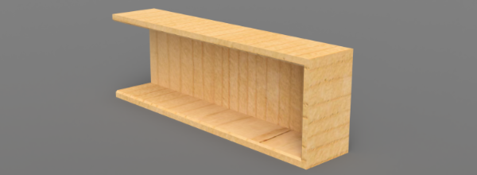

# LPC845 Tower Blocks Accelerometer/Audio Demo

This projects uses the [FXOS8700](https://www.adafruit.com/product/3463) 3-axis
accelerometer and magnetometer, and the [PAM8302](https://www.adafruit.com/product/2130)
2.5W class D audio amplifier to detect motion and send out an audio alert when
any vibration is detected in wooden-block tower games (Jenga, etc.).

The goal is simply to add a small additional level of 'stress' when removing
blocks from the tower as the game progresses, and to put together an example of
how to use the DAC for audio output on the low-cost LPC845, since this
particular MCU has dual DAC outputs and is a good low-cost option for
generating audio data without a lot of software or hardware overhead.

Audio output is generated using a single DAC on the LPC845, with DMA transfers
from the sample buffer to the DAC's output pin, into the audio amp, and out to
a small, low-cost speaker that (mostly!) fits inside the wooden block

Colors on the onboard RGB LEDs will also change as motion is detected, to add a visual
indication in addition to the audio element.

A simple model of an empty 'Jenga' style wodden block was created in Autodesk
Fusion 360, and milled on a 3 axis CNC mill, although it should be possible
to do the same procedure using a variety of wood-working tools.

## Hardware Setup

The following hardware was used in this demo:

- [**LPC845-BRK**](https://www.nxp.com/products/processors-and-microcontrollers/arm-based-processors-and-mcus/lpc-cortex-m-mcus/lpc800-series-cortex-m0-plus-mcus/lpc845-breakout-board-for-lpc84x-family-mcus:LPC845-BRK) (ridiculously cheap ARM Cortex M0+ dev board with on-board debugger!)
- [Adafruit Precision NXP 9-DOF Breakout Board - **FXOS8700 + FXAS21002**](https://www.adafruit.com/product/3463)
- [Adafruit Mono 2.5W Class D Audio Amplifier - **PAM8302**](https://www.adafruit.com/product/2130)
- [Mini Oval Speaker - 8 Ohm 1 Watt](https://www.adafruit.com/product/3923)

Other audio parts should work, but the above were used here since I already had
them on hand.

While this project uses the **FXOS8700**, there is also a driver for the
similar **MMA8652**. It should be relatively easy to swap the FXOS out for the
MMA if you have access to the MMA8652!

### Pinouts

The various components of this project are connected as follows:

#### LPC845-BRK to FXOS8700

| Function   | LPC845-BRK Location | FXOS8700 Pin |
|------------|---------------------|--------------|
| SCL        | CN1-24 (PIO0_10)    | SCL          |
| SDA        | CN1-23 (PIO0_11)    | SDA          |
| VCC (3.3V) | CN1-40              | VIN          |
| GND        | CN1-20              | GND          |

**NOTE**: The Adafruit breakout with the FXOS8700 is populated with pullup
resistors on the SCL and SDA lines, so they don't need to be added to the
project. If you are using a breakout WITHOUT these pullups, they will need to
be added for the I2C bus to function correctly.

#### LPC845-BRK to PAM8302

| Function   | LPC845-BRK Location | PAM8302 Pin  |
|------------|---------------------|--------------|
| DAC0       | CN1-2 (PIO0_17)     | A+           |
| GND        | CN1-20              | A-           |
| VCC (3.3V) | CN1-40              | VIN          |
| GND        | CN1-20              | GND          |

#### Speaker to PAM8302

The speaker goes into the two pins on the audio output of the PAM8302.

**WARNING**: This audio amp can output up to 2.5W, and we are using a 1W mini
speaker (for size reasons). As such, be careful not to output signals with
long, high peaks. You can also divide the DAC output values by an appropriate
amount, taking the speaker you use into account (simply divide all numbers by
two or even 2/3, for example).

## Software Design

This project continually reads the input from the 3-axis accelerometer, and converts
the raw accelerometer data into roll and pitch 'angles'. By tracking the current
angular position, and comparing it with the last angular position, we detect when a
change or more than 1° occurs. The exact crossover threhold is adjustable, and is
defined using the following macro:

```
/* Accelerometer delta (degrees to register as a valid motion event) */
#define ACCEL_DELTA_DEGREES			(1.0)
```

The **DAC** is configured to run at 8kHz (typical frequency for telephones, etc.),
using **DAC0** and **DMA channel 22**.

The audio alert consists of a pre-defined array of 10-bit unsigned values, which
are fed to the DAC via DMA transfers whenever a motion 'event' is detected.

Every motion event that is detected (angular change >= `ACCEL_DELTA_DEGREES`) will
queue one 'tick' for the audio output, and these 'ticks' will results in a sequence
of blips, where the audio buffer is sent out one to the DAC. If a large amount of
motion is detected, the audio alert will this become longer and more pronounced.

The color of the onboard LEDs will also change whenever a motion event is detected,
to add a visual element for the hearing impaired, etc.

## Future Developments

It should be possible to update this code to play a different audio sample, detect free
fall when the tower collapses, etc., depending on your own design goals. The aim of the
project today was primarily to put all the pieces together for DMA-based audio, plus motion
detection, as better mechanical options are pursued to the enclosure, and potentially
a PCB daughter-board can be designed to be soldered to the LPC845-BRK to save space and
add mechanical strength.

## Demonstration

The following video shows the motion sensitivity of the device. Any sort of
movement or touch, and the audio event fires, which might even be OVERLY
sensitive, but it's easy to adjust in the firmware:

> Click the image below to see the video on youtube!

[](https://youtu.be/WVSEb37vCyU)

**NOTE**: The audio in the video above is relatively muted, but the sound is
louder (and adjustable!) in real life. The audio was initially kept low to
avoid blowing out the 1W speaker during initial testing.

## Design Files

The .step file for the wooden block used in this project is available below
for 3D printing, CNC milling, etc.:



[lpc845_wooden_block.step](lpc845_wooden_block.step)
